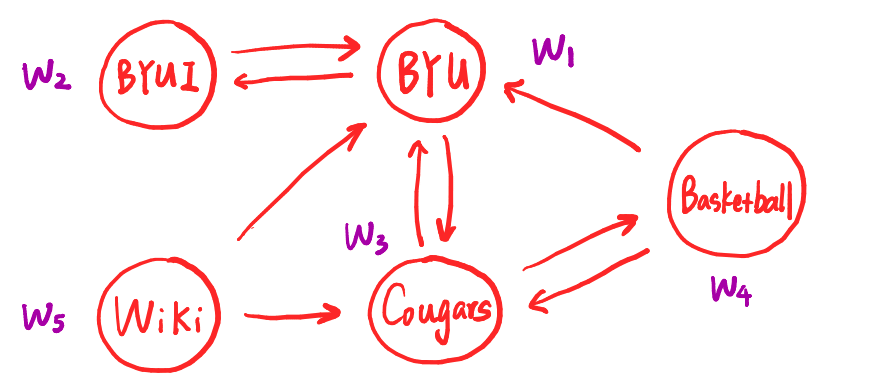
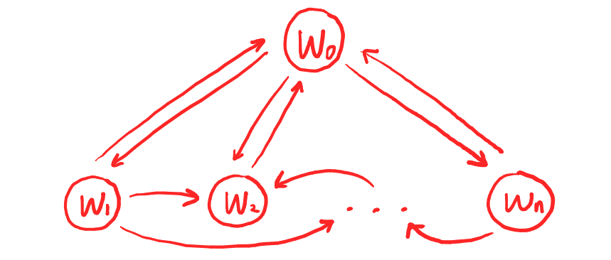
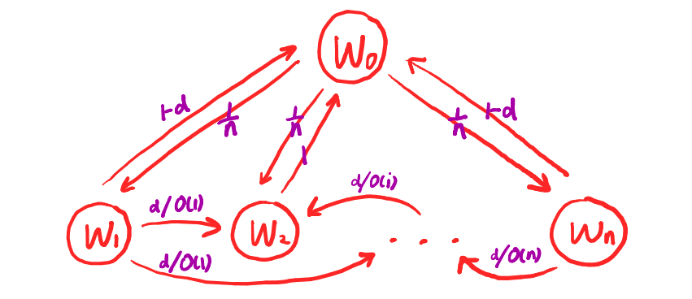

# Dynamics in Search Engines

Investigation of Google's PageRank Algorithm.


## Search Engines

### Framework

1. crawlers: 
gather raw information from webpages;

2. indexer: 
analyzes the collected data to produce a set of word occurrences for each webpage $\rightarrow$ forward index;

    | Documents     | Words              | 
    | ------------- |:------------------:| 
    | document 1    | "cats", "are", ... | 
    | document 2    | "so", "cute", ...  | 


3. sorter: 
rearranges information by words $\rightarrow$ inverted index

    | Words      | Documents          | 
    | ---------- |:------------------:| 
    | "math"     | document 1, 7 ...  | 
    | "fun"      | document 2, 3 ...  | 

4. searcher: uses the inverted index to compile a list of documents
relevant to the keywords and phrases of the query


### Results List

Determine the order of the list:
 - relevance of the document to the query 
 (relative position, fonti cation, and frequency of the keywords)

- various ways to rank webpages
(Google: the PageRank algorithm)


## Google PageRank

### General Idea

- **Intuition**: a website should be more important if is visited more
often.

- **Model**: suppose a random surfer is wandering around the webpages
randomly. After su ciently many steps, the websites can be ranked
by how many times they were visited.

- **PageRank**: the probability that the surfer will end up on that page.
Or the fraction of time the random user spends on that page in the
long run.


### Example

We consider the following webpages from BYU.

<picture>
  <source media="(prefers-color-scheme: dark)" srcset="./figures/byu.png" width="600">
  
</picture>

And we constructed the following model accordingly. 

```math
    A = \begin{bmatrix}
    0 & 1 & 1 & 1 & 1 \\
    1 & 0 & 0 & 0 & 0 \\
    1 & 0 & 0 & 1 & 1 \\
    0 & 0 & 1 & 0 & 0 \\
    0 & 0 & 0 & 0 & 0
    \end{bmatrix}, 
    \quad e = \begin{bmatrix}
    1\\
    1\\
    1\\
    1\\
    1
    \end{bmatrix},
    \quad Ae = \begin{bmatrix}
    4 \\
    1 \\
    3 \\
    1 \\
    0
    \end{bmatrix}: \text{ number of incoming edges}
    \quad
    A^2e = \begin{bmatrix}
    5 \\
    4 \\
    5 \\
    3 \\
    0
    \end{bmatrix}: \text{counts latent edges}
```


### Central Task

Given a collection of webpages $w_1,\cdots w_n$ and the links between them:

- Construct a Markov chain (matrix $A$) on $w_1,\cdots w_n$, which consists of the transition probabilities between webpages.
       
- $A$ is chosen (or could be modified) to be "good" enough such that, for some initial distribution $x_0$, the sequence $\{A^kx_0\}$ will converge to a vector whose entries give us the rank of each webpage.


### Model

Let $G$ be a directed graph in which the webpages $w_1,\cdots, w_n$ serve as vertices and the links as directed edges. Let $\tilde{G}$ be the graph obtained from $G$ by adding a vertex $w_0$ with edges to and from all other vertices. Let $O(i)$ be the number of outgoing edges from $w_i$ in $G$.

    
Let $A = (a_{ij})$ with $a_{ij}$ being the probability of entering page $i$ given the currrent page is $j$, and $\sum_i a_{ij} = 1$ for any $j$. Let $0\< d \<1$ be a damping parameter.

<picture>
  <source media="(prefers-color-scheme: dark)" srcset="./figures/A_clean.png" width="600">
  
</picture>


For maxtrix $A$, we have the following settings.

$$a_{ii} = 0, \ 0\leqslant i\leqslant n; \qquad a_{i0} = 1 / n, \ 0 \< i \leqslant n;$$

$$a_{0i} = \begin{cases}
    1-d & O(i) \neq 0 \\
    1 & O(i) = 0
    \end{cases}, \quad
    0 \< i \leqslant n;$$

$$a_{ij} = \begin{cases}
    d / O(j) & \text{if } j \text{ links to } i \\
    0 & \text{if } j \text{ does not link to } i
    \end{cases}, \quad i,j \> 0, i\neq j.$$


<picture>
  <source media="(prefers-color-scheme: dark)" srcset="./figures/A.png" width="600">
  
</picture>


### Algorithm


- **Claim**: $A$ is stochastic and primitive. By Perron's Theorem, $\rho(A) = 1$ is an algebraically simple eigenvalue of $A$ and there exists $q>0$ with $\sum_i q_i = 1$ such that $Aq = q$.


- **Algorithm** (Power Iteration): 

$$\text{Choose arbitrary }  x^{(0)} > 0 \text{ with } \sum_i x_i^{(0)} = 1$$

$$x^{(k+1)} = Ax^{(k)} \ (= A^{k+1} x^{(0)})$$


- **Remark**: $\{x^{(k)}\}$ will converge to the stationary distribution $q$. The algorithm will stop when the relative errors is smaller than some chosen tolerance. 


## Analysis

### Preliminary

- **Spectral radius**: $\rho(A) = \max\{|\lambda_1|, \cdots, |\lambda_n|\}$
        
- **Primitive**: A nonnegative square matrix $A$ is primitive if $A^k > 0$ for some $k \in \mathbb{N}$.

        
- **Stochastic**: A nonnegative square matrix is (left) stochastic if the sum of the entries in each column is 1.


### Perron's Theorem

**Theorem (Perron).** Let $A$ be a primitive square matrix, then

- $\rho(A) \> 0$,
- $\rho(A)$ is an algebraically simple eigenvalue of $A$,
- $|\lambda| \< \rho(A)$ for any eigenvalue $\lambda \neq \rho(A)$,
- $\exists$ a unique positive vector $x$ that $Ax = \rho(A)x$ and $\sum_i x_i = 1$.


**Corollary.** Let $A$ be a primitive stochastic matrix, then

- $\rho(A) = 1$,
- $\rho(A) = 1$ is an algebraically simple eigenvalue of $A$,
- $|\lambda| \< 1$ for any eigenvalue $\lambda \neq 1$,
- $\exists$ a unique positive vector $x$ that $Ax = x$ and $\sum_i x_i = 1$.


### PageRank Model

**Setup**: $A = (a_{ij})$, $0 \< d \< 1$.

- **stochastic**: $\sum_i a_{ij} = 1$ for any $j$.
- **primitive**: in the directed graph $\tilde{G}$, any page $w_i$ is reachable (with positive probability) from any page $w_j$ via the restart page $w_0$ after sufficiently many steps.


<picture>
  <source media="(prefers-color-scheme: dark)" srcset="./figures/A.png" width="600">
  
</picture>


### Convergence

- Let $q_1$ be the positive Perron vector that $Aq_1 = q_1$ and $\sum_i q_i = 1$.
        
- The generalized eigenspace $M(\lambda)$ of $A$ associated with $\lambda$ is composed of a collection of Jordan chains: 

$$(A-\lambda I)^{m_1-1}v_1, (A-\lambda I)^{m_1-2}v_1, \cdots, (A-\lambda I)v_1, v_1;$$

$$(A-\lambda I)^{m_2-1}v_2, (A-\lambda I)^{m_2-2}v_2, \cdots, (A-\lambda I)v_2, v_2; \cdots$$
        
- $\mathbb{R}^n = M(\lambda_1) \oplus \cdots \oplus M(\lambda_p) \Rightarrow$ The generalized eigenvectors of $A$ form a basis $\{q_1,q_2,\cdots, q_n\}$ of $\mathbb{R}^n.$


- For the basis $\{q_1,q_2,\cdots, q_n\}$, we have $Aq_1 = q_1$ and

$$Aq_t = \lambda_j q_t \text{ or } Aq_t = \lambda_j q_t + q_{t+1} \text{ for } t\neq 1, |\lambda_j|<1.$$
       
- Hence 

$$\lim_{k\rightarrow\infty}A^kq_1 = q_1, \quad \lim_{k\rightarrow\infty} A^k q_t = 0, t\neq 1$$


